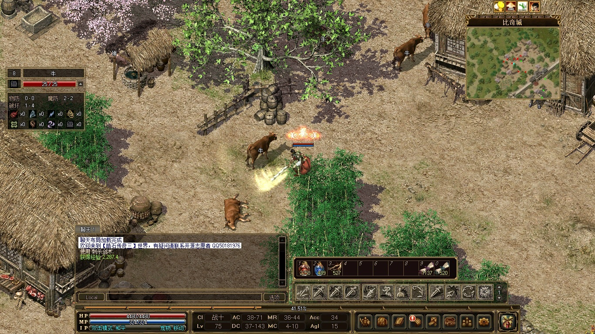
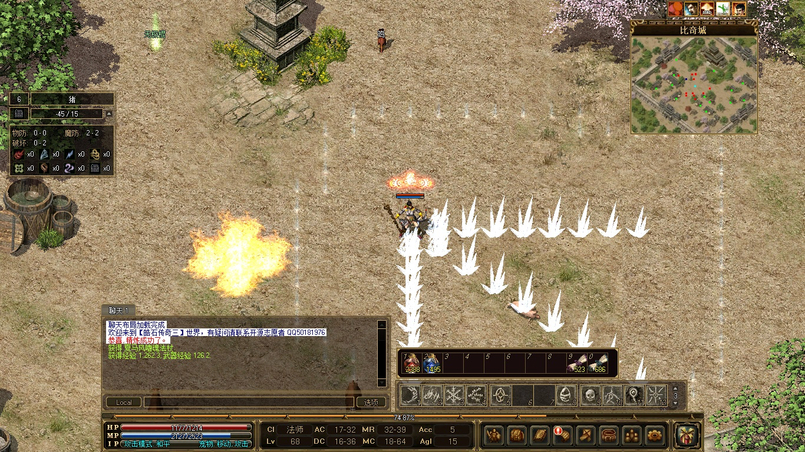
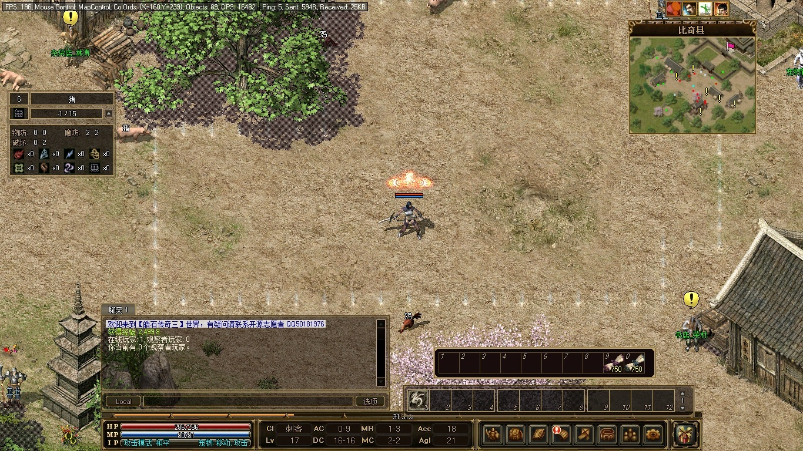
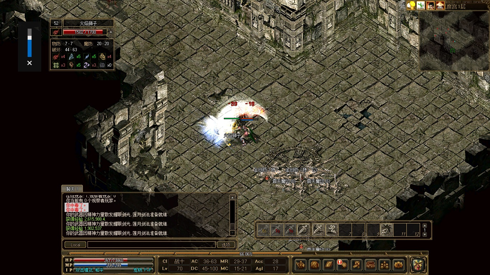
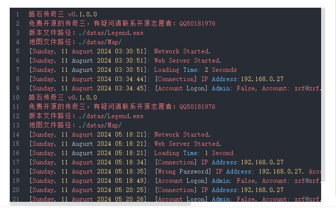
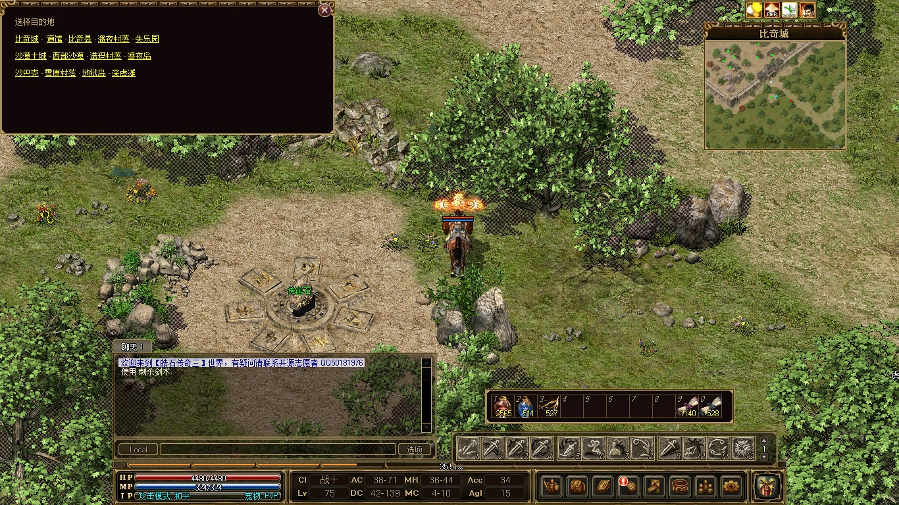
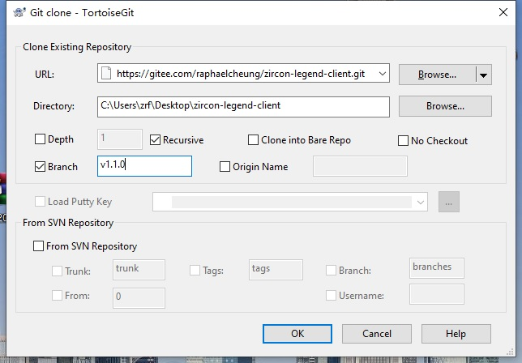

# 皓石传奇三 -客户端 Zircon Mir3 Client

本开源项目仅供学习游戏技术，禁止商用以及非法用途。

觉得本项目对你有帮助的别忘了 **点个星** ，祝你年年发大财！

技术交流以及体验公益服请加 【[QQ群：915941142](https://qm.qq.com/q/JeoJOJ4z4e)】

## 游戏简介

### 完整的传奇三游戏

- 含了四个职业：战士、法师、道士、刺客 
 
 
 
	
- 技能丰富，平均每个职业有 38 个技能 
 

- 地图和道具及其丰富，玩到 100级没压力；

- 技能正常修炼到 3级以后，还可通过打出高等级技能书一直升到 6级；

- 武器和首饰均可精炼，品质高的装备精炼上限也更高；

- 法师招宠与道士的宠物最高可升至暗金等级，各项属性翻倍，非常实用；

- 刺杀剑术破防之余，技能等级越高，刺杀剑术的攻速越快，爽之又爽；

### 支持多平台部署

服务端支持在 Linux、Windows、Docker 平台上部署。

 
	
### 便捷传送

每个传送石都可以方便地传送到任意地图。 

 

## 客户端 运行指南

### 注意

- 直接运行客户端或者通过 [启动器](https://gitee.com/raphaelcheung/zircon-legend-launcher) 运行都可以正常进入游戏。

- 如果需要客户端自动更新，则必须通过 [启动器](https://gitee.com/raphaelcheung/zircon-legend-launcher) 来启动。

### 下载依赖数据

包含了海量地图和道具资源，压缩后仍有 3GB 大小，只能通过百度网盘来分享。

【[百度网盘 2024-8-14](https://pan.baidu.com/s/1OMkb834cOtxF8KIrlJMKRQ?pwd=h1bv)】

如果嫌百度网盘太慢，这份数据我也放到了 QQ 群文件中，【[QQ群：915941142](https://qm.qq.com/q/JeoJOJ4z4e)】

### 安装依赖组件

- .Net Framework 4.8

- DirectX 9.0

- C++ 运行库 （本项目不直接依赖，只是 SlimDX 依赖，建议安装合集，QQ群文件有提供）

### 下载执行文件

从本项目 [发布页面](https://gitee.com/raphaelcheung/zircon-legend-client/releases) 下载最新的运行文件，与前面已下载的依赖数据文件解压到同一目录。

根据自己的情况修改` Legend.ini `中的服务器地址、端口。

## 客户端启动器 运行指南

参见项目 【[ZirconLegend-Client](https://gitee.com/raphaelcheung/zircon-legend-launcher)】

## 服务器 部署指南

参见项目 【[ZirconLegend-Server](https://gitee.com/raphaelcheung/zircon-legend-server)】

## 客户端 代码编译

开发环境依赖：

- Microsoft Visual Studio Community 2022

- .Net Framework 4.8

运行时还依赖：

- DirectX 9.0

安装这些后拉取全库代码，拉取的时候要选中` Recursive `。这样才能把子模块一并拉取下来。

主干处于持续开发状态，推荐拉取发布版本。 
 

项目的编译依赖都已预设好，直接编译即可。